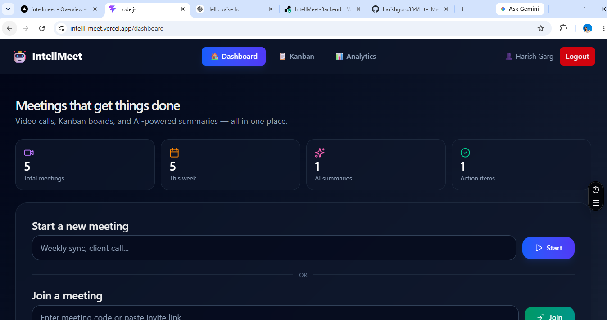
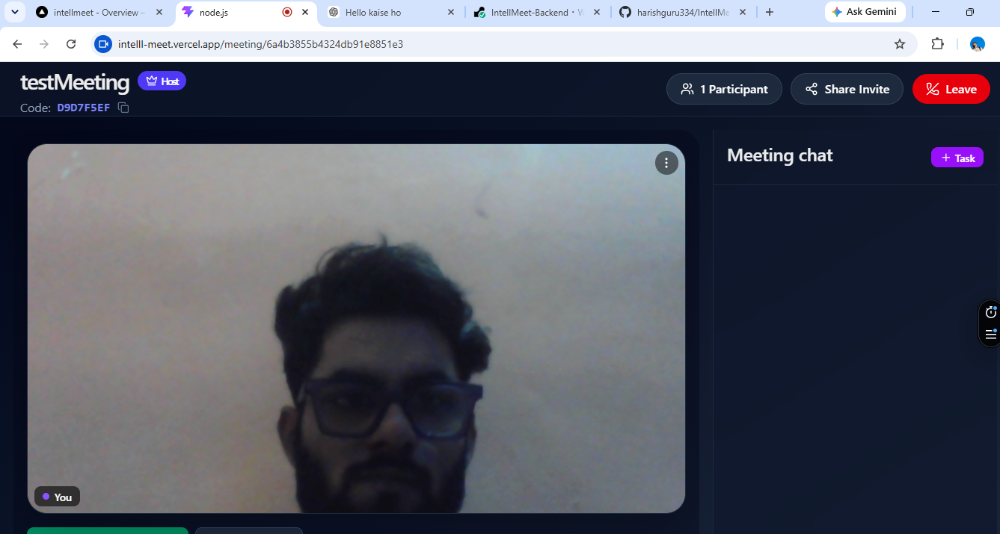
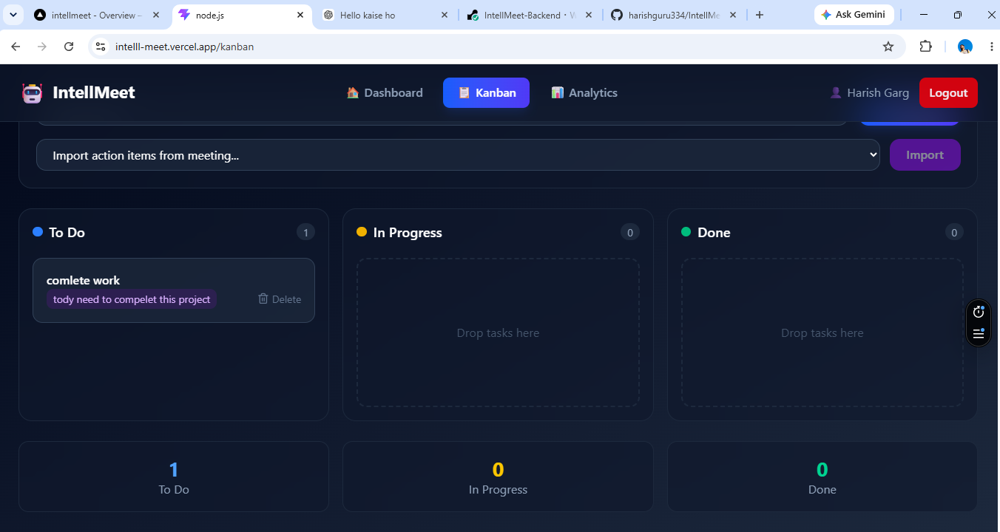
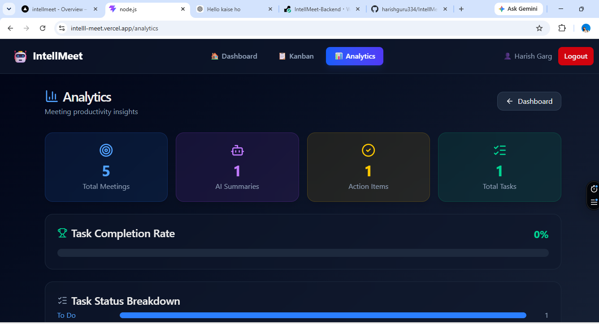
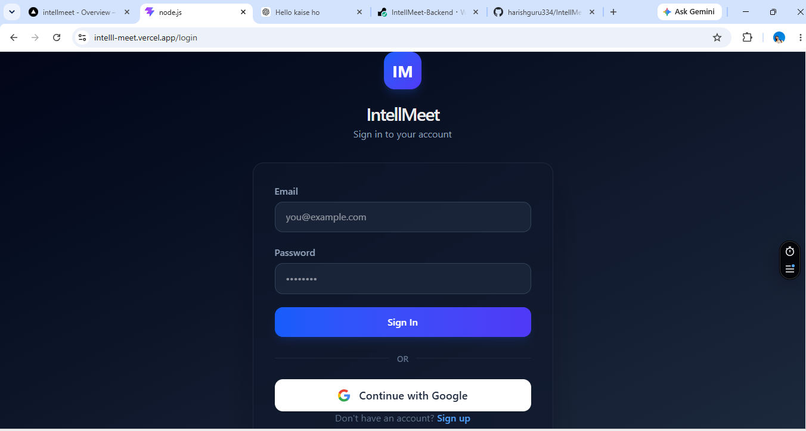

# IntellMeet

### AI-Powered Real-Time Meeting & Team Collaboration Platform

IntellMeet is a full-stack MERN application designed to turn online meetings into actionable outcomes.

Instead of stopping at video calls, IntellMeet combines **real-time video conferencing, live chat, meeting transcription, AI-generated summaries, task management, Kanban workflows, and analytics** in one platform.

It is designed around a simple idea:

> **Meet → Understand → Convert into Tasks → Track → Analyze**

---

## Live Application

**Frontend:**
https://intell-meet-ashen.vercel.app

**Backend API:**
https://intellmeet-ux78.onrender.com

---

## The Problem

Traditional meeting platforms are primarily focused on communication.

After a meeting, teams often still need to:

- Write meeting notes manually
- Remember important discussion points
- Convert decisions into tasks
- Track those tasks in another application
- Review meeting productivity separately

IntellMeet brings these workflows together. A meeting can become a source of **transcripts, AI summaries, action items, tasks, and productivity insights** without requiring completely separate tools.

---

# Core Features

## 🎥 Real-Time Video Meetings

Users can create meeting rooms and join meetings using a meeting code or invite link.

The video layer uses **PeerJS (built on WebRTC)** for peer-to-peer audio/video communication.

Features include:

- Create meeting rooms
- Join using meeting code
- Real-time camera and microphone
- Participant handling
- Mute/unmute microphone
- Enable/disable camera
- Screen sharing (`getDisplayMedia`)
- Local screen recording, downloaded as a `.webm` file
- Meeting invite / meeting-code sharing (copy to clipboard)
- Host identification
- Leave meeting controls

PeerJS handles the WebRTC peer connection (using its own signaling broker) while Socket.IO is used separately for application-level real-time events — peer discovery, room membership, chat, and transcript delivery.

> **Note:** Recording is currently **client-side only** — it captures the local screen/tab via the browser and downloads a `.webm` file. There is no server-side or cloud recording storage yet.

---

## 💬 Real-Time Meeting Chat

Participants can communicate through an integrated meeting chat. Chat events are delivered in real time using **Socket.IO**, keeping meeting communication inside the same workspace rather than requiring an external messaging application.

---

## 📝 Live Meeting Transcript

IntellMeet supports live transcript capture during meetings. Users can start transcription directly from the meeting room and view the captured conversation while the meeting is in progress.

The transcript can later be used as context for AI-powered meeting processing.

---

## 🤖 AI Meeting Summaries

Meeting information is processed through the AI layer to generate structured meeting summaries.

The AI integration uses **Groq** (via `groq-sdk`) for fast inference.

The goal is to transform raw meeting discussions into useful information such as:

- Meeting summaries
- Important discussion points
- Action items
- Follow-up information

This reduces the need to manually prepare meeting notes after every call.

---

## 📋 Meeting-Based Task Management

Tasks can be created directly from the collaboration workflow. Instead of discussing something in a meeting and then manually opening another project-management application, users can move directly from:

**Meeting → Action Item → Task**

Tasks can then be managed through the built-in Kanban board.

---

## 🗂️ Drag-and-Drop Kanban Board

IntellMeet includes a task-management workspace built around a Kanban workflow.

Tasks are organized into:

- To Do
- In Progress
- Done

Drag-and-drop functionality is powered by **@dnd-kit**. Meeting action items can also be imported into the task workflow.

---

## 📊 Analytics Dashboard

The analytics module provides productivity insights based on meeting and task activity, including:

- Total meetings
- AI summaries generated
- Action items
- Total tasks
- Task completion rate
- Task status breakdown

This provides a higher-level view of what happens **after meetings**, not just during them.

---

## 🔐 Authentication & Authorization

IntellMeet supports multiple authentication methods.

### Email & Password
Users can create an account and authenticate using traditional credentials. Passwords are securely hashed using **bcrypt**.

### JWT Authentication
JWT tokens are used for authenticated application access and protected backend routes.

### Google OAuth
Users can also authenticate using their Google account, implemented using **Passport.js** and OAuth 2.0.

---

# Application Screenshots

## Dashboard
The main dashboard provides meeting statistics, AI summary information, action items, meeting creation, meeting joining, and access to existing meetings.



---

## Meeting Room
The meeting workspace combines video communication with collaboration tools including transcription, screen sharing, local recording controls, AI summaries, chat, and tasks.


---

## Meeting Chat
Real-time messaging is available directly inside the meeting room.



---

## Kanban Task Management
Tasks generated manually or from meeting action items can be managed using the integrated Kanban board.



---

## Analytics
Meeting and task activity is transformed into productivity insights.



---

## Authentication
IntellMeet supports email/password authentication as well as Google OAuth.



---

# Tech Stack

## Frontend

| Technology | Purpose |
|---|---|
| React 19 | Frontend application |
| Vite | Development & build tooling |
| React Router | Client-side routing |
| Tailwind CSS | UI styling |
| Axios | API communication |
| Socket.IO Client | Real-time communication |
| PeerJS | WebRTC peer communication |
| @dnd-kit | Kanban drag-and-drop |
| Lucide React | Icons |
| React Hot Toast | Notifications |

## Backend

| Technology | Purpose |
|---|---|
| Node.js | JavaScript runtime |
| Express.js 5 | REST API server |
| MongoDB | Database |
| Mongoose | MongoDB ODM |
| Socket.IO | Real-time events |
| Redis / ioredis | Caching |
| JWT | Authentication |
| bcrypt | Password hashing |
| Passport.js | Google OAuth authentication |
| Express Session | OAuth session handling |
| Groq SDK | AI meeting summary generation |

---

# System Architecture

```text
                         ┌─────────────────────┐
                         │       Browser       │
                         └──────────┬──────────┘
                                    │
                         ┌──────────▼──────────┐
                         │   React + Vite UI   │
                         └──────────┬──────────┘
                                    │
             ┌──────────────────────┼──────────────────────┐
             │                      │                      │
             ▼                      ▼                      ▼

       REST API                 Socket.IO               PeerJS
          │                         │                      │
          │                    Real-time             WebRTC P2P
          │                     Events                Video/Audio
          │                         │                      │
          └──────────────┬──────────┘                      │
                         │                                 │
                  ┌──────▼──────┐                          │
                  │ Express API │                          │
                  └──────┬──────┘                          │
                         │                                 │
          ┌──────────────┼──────────────┐                  │
          │              │              │                  │
          ▼              ▼              ▼                  │

       MongoDB          Redis          Groq AI         STUN / TURN
```

---

# Real-Time Architecture

IntellMeet uses two different real-time layers.

### PeerJS / WebRTC
PeerJS is responsible for actual peer-to-peer audio and video communication. WebRTC connections use STUN/TURN infrastructure for NAT traversal.

The current implementation follows a **P2P mesh architecture**, meaning participants establish direct connections with other participants.

### Socket.IO
Socket.IO handles application-level real-time communication including:

- Peer ID discovery
- Room events
- Participant events
- Chat messages
- Transcript-related events

This keeps the video transport and application messaging responsibilities separated.

---

# Project Structure

```text
IntellMeet/
│
├── Backend/
│   ├── Config/
│   ├── Controllers/
│   ├── Models/
│   ├── Routes/
│   ├── middleware/
│   ├── server.js
│   └── package.json
│
├── IntellMeet/
│   ├── public/
│   ├── src/
│   │   ├── Api/
│   │   ├── Components/
│   │   ├── Context/
│   │   ├── Pages/
│   │   ├── App.jsx
│   │   └── main.jsx
│   │
│   ├── package.json
│   ├── vite.config.js
│   └── vercel.json
│
├── .gitignore
└── README.md
```

---

# Running IntellMeet Locally

## 1. Clone the Repository

```bash
git clone https://github.com/harishguru334/IntellMeet.git
cd IntellMeet
```

## 2. Backend Setup

Navigate to the backend:

```bash
cd Backend
```

Install dependencies:

```bash
npm install
```

Create a `.env` file and configure the required environment variables.

Example:

```env
PORT=8000

MONGO_URI=your_mongodb_connection_string

JWT_SECRET=your_jwt_secret

GROQ_API_KEY=your_groq_api_key

REDIS_URL=your_redis_connection_url

GOOGLE_CLIENT_ID=your_google_client_id

GOOGLE_CLIENT_SECRET=your_google_client_secret

SESSION_SECRET=your_session_secret

FRONTEND_URL=http://localhost:5173
```

Additional variables may be required depending on the deployment configuration.

Start the backend:

```bash
npm start
```

## 3. Frontend Setup

Open another terminal and navigate to the frontend:

```bash
cd IntellMeet
```

Install dependencies:

```bash
npm install
```

Configure the frontend environment variables required to connect to the backend (e.g. `VITE_SOCKET_URL`, API base URL).

Then start the Vite development server:

```bash
npm run dev
```

---

# Deployment

### Frontend
The React frontend is deployed on **Vercel**.
https://intell-meet-ashen.vercel.app

### Backend
The Node.js/Express API is deployed on **Render**.
https://intellmeet-ux78.onrender.com

MongoDB provides persistent application storage, while Redis is used for caching.

---

# Current Architecture Limitations

IntellMeet currently uses a **Peer-to-Peer WebRTC mesh architecture** (via PeerJS).

This architecture works well for smaller meetings but is not designed for large video conferences, since each participant maintains a direct connection with every other participant. Bandwidth and CPU cost grow quickly as more people join.

A production-scale version would benefit from an **SFU architecture** using technologies such as LiveKit, mediasoup, or another dedicated media server.

Additionally:

- Meeting recording is currently **local/client-side only** (captured via the browser and downloaded as `.webm`) — there is no server-side recording pipeline or cloud storage yet.
- The backend defines legacy raw WebRTC signaling socket events (`webrtc-offer`, `webrtc-answer`, `webrtc-ice-candidate`) that are not currently used by the frontend, since video signaling is handled through PeerJS instead. These are candidates for cleanup.

This is an architectural improvement planned for future versions rather than something the current implementation claims to solve.

---

# Future Improvements

Planned improvements include:

- SFU-based scalable video conferencing
- Server-side / cloud meeting recording
- Better transcription accuracy
- Advanced AI-generated meeting insights
- Automated action-item extraction
- Calendar integration
- Email meeting invitations
- Workspace and team management
- File sharing
- Notification system
- Improved analytics
- Automated testing
- Monitoring and logging
- Improved mobile experience

---

# What This Project Demonstrates

IntellMeet goes beyond a traditional CRUD-based MERN project. The project demonstrates practical implementation of:

- Full-stack MERN architecture
- REST API design
- MongoDB data modeling
- JWT authentication
- Google OAuth
- Real-time Socket.IO communication
- WebRTC video communication via PeerJS
- Redis caching
- AI API integration (Groq)
- Drag-and-drop state management
- Meeting and task workflows
- Analytics
- Frontend/backend deployment

---

# Author

## Harish Guru

**MERN Stack / Full-Stack Developer**

Portfolio: https://harish-guru.vercel.app/
LinkedIn: https://www.linkedin.com/in/harish-guru-a77a50224/
Email: harishgarg334@gmail.com
GitHub: https://github.com/harishguru334

---

## License

This project was built for learning, development, and portfolio demonstration purposes.
